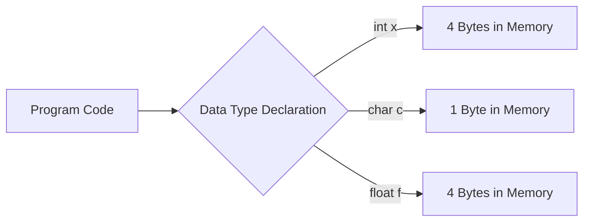

# Day 1: Variables, Data Types, Operators, and Constants

## Theory and Description

In C programming, the basic building blocks are variables, data types, operators, and constants.

1. **Variables**: A variable is a named storage location in memory that holds a value. The value of a variable can change during program execution.
2. **Data Types**: Data types specify the type of data that a variable can store. This determines the amount of memory allocated and the operations that can be performed.
    - `int`: Integer values (e.g., 10, -5). Size typically 4 bytes.
    - `float`: Single-precision floating-point values (e.g., 3.14). Size typically 4 bytes.
    - `double`: Double-precision floating-point values. Size typically 8 bytes.
    - `char`: Single characters (e.g., 'a', 'Z'). Size 1 byte.
3. **Constants**: Constants are fixed values that do not change during program execution. They can be defined using the `const` keyword or `#define` preprocessor directive.
4. **Operators**: Operators are symbols that tell the compiler to perform specific mathematical or logical manipulations.
    - *Arithmetic Operators*: `+`, `-`, `*`, `/`, `%`
    - *Relational Operators*: `==`, `!=`, `>`, `<`, `>=`, `<=`
    - *Logical Operators*: `&&` (AND), `||` (OR), `!` (NOT)

### Block Diagram: Memory Allocation



## Features and Differences

### `int` vs `float` vs `double`
- `int` stores whole numbers and is faster to compute.
- `float` stores decimals but with 6-7 digits of precision.
- `double` stores decimals with 15-16 digits of precision (uses more memory).

### `const` keyword vs `#define`
- `const` provides type checking, while `#define` is a simple text substitution by the preprocessor before compilation.

---

## Assignment Questions and Answers

**Q1. What is the difference between `=` and `==` in C?**
*Answer*: `=` is the assignment operator used to assign a value to a variable (e.g., `x = 5`). `==` is the relational operator used to compare two values for equality (e.g., `x == 5` returns true or false).

**Q2. Write a program to calculate the area of a circle using a constant for PI.**
*Answer*:
```c
#include <stdio.h>
#define PI 3.14159

int main() {
    float radius = 5.0;
    float area = PI * radius * radius;
    printf("Area is: %f", area);
    return 0;
}
```

**Q3. Explain the modulus operator `%`.**
*Answer*: The modulus operator divides two integers and returns the remainder. It only works with integer data types. For example, `10 % 3` evaluates to `1`.
