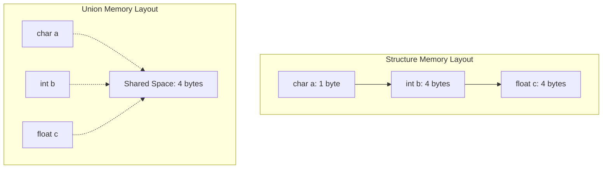

# Day 10: Structures and Unions

## Theory and Description

A **structure** is a user-defined data type in C that allows you to combine data items of **different kinds** under a single name. It is used to represent a record.

### Key Concepts
1. **Definition**: Declared using the `struct` keyword.
2. **Accessing Members**: Members are accessed using the dot (`.`) operator for normal structure variables, and the arrow (`->`) operator for structure pointers.
3. **Array of Structures**: You can create arrays where each element is a structure (e.g., storing a list of students).
4. **Union**: Similar to a structure, but all members share the **same memory location**. The size of a union is the size of its largest member.

### Block Diagram: Structure vs Union Memory Layout



## Features and Differences

### Structure vs Union
- **Memory**: A `struct` allocates separate memory for each member. A `union` allocates one block of shared memory equal to the size of its largest member.
- **Data Access**: In a `struct`, all members can hold values simultaneously. In a `union`, only one member can contain a valid value at any given time.

---

## Assignment Questions and Answers

**Q1. Write a program to store and print the details of a student using a structure.**
*Answer*:
```c
#include <stdio.h>

struct Student {
    char name[50];
    int roll;
    float marks;
};

int main() {
    struct Student s1 = {"Alice", 101, 89.5};
    printf("Name: %s\nRoll: %d\nMarks: %.2f", s1.name, s1.roll, s1.marks);
    return 0;
}
```

**Q2. What is the use of `typedef` with structures?**
*Answer*: `typedef` allows you to create an alias for a data type. Instead of writing `struct Student s1;` every time, you can define `typedef struct Student { ... } Student;` and simply use `Student s1;`.

**Q3. Explain how to pass a structure to a function.**
*Answer*: Structures can be passed by value (which copies the entire structure) or by reference using pointers (which is more efficient). When passing by reference, you use the `->` operator inside the function to access members.
