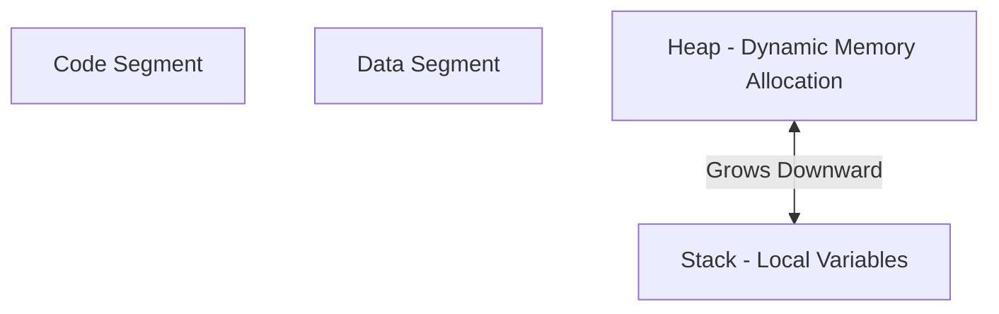

# Day 11: Dynamic Memory Allocation

## Theory and Description

Dynamic Memory Allocation (DMA) allows a program to allocate memory at runtime in the **Heap** memory segment, rather than at compile time in the Stack. This is essential for creating data structures whose size can change during execution (like linked lists) or for arrays when the size is unknown at compile time.

### Core DMA Functions (`<stdlib.h>`)
1. **`malloc(size)`**: Allocates a single block of memory of the specified size. Contains garbage values initially.
2. **`calloc(n, size)`**: Allocates memory for an array of `n` elements of `size` bytes each. Initializes all bytes to zero.
3. **`realloc(ptr, new_size)`**: Resizes a previously allocated memory block.
4. **`free(ptr)`**: Deallocates the memory block, returning it to the system.

### Block Diagram: Memory Architecture



## Features and Differences

### `malloc()` vs `calloc()`
- **Initialization**: `malloc()` leaves the memory uninitialized (garbage values). `calloc()` initializes the memory to zero.
- **Parameters**: `malloc()` takes one argument (total bytes). `calloc()` takes two arguments (number of elements, size per element).

### Static vs Dynamic Memory Allocation
- **Static**: Memory size is fixed at compile time. Fast, but rigid.
- **Dynamic**: Memory size is decided at runtime. Flexible, but slower and requires manual management (`free()`) to avoid memory leaks.

---

## Assignment Questions and Answers

**Q1. Write a C program to dynamically allocate memory for an integer array of size 5 using `malloc()`.**
*Answer*:
```c
#include <stdio.h>
#include <stdlib.h>

int main() {
    int *arr = (int*) malloc(5 * sizeof(int));
    if (arr == NULL) {
        printf("Memory allocation failed!\n");
        return 1;
    }
    
    for(int i = 0; i < 5; i++) {
        arr[i] = i + 1;
        printf("%d ", arr[i]);
    }
    
    free(arr); // Prevent memory leak
    return 0;
}
```

**Q2. What is a Memory Leak?**
*Answer*: A memory leak occurs when a program dynamically allocates memory (e.g., using `malloc`) but fails to release it using `free()` after it's no longer needed. Over time, this exhausts the system's available memory.

**Q3. What does `realloc` do if the new size is larger than the old size?**
*Answer*: `realloc` will attempt to expand the memory block in place. If there is not enough contiguous memory available at the current location, it allocates a new block, copies the old data to the new block, frees the old block, and returns the new pointer.
