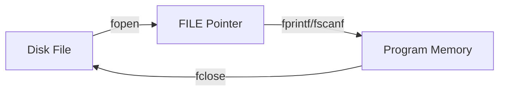

# Day 12: File Handling in C

## Theory and Description

File handling in C enables programs to store data permanently on a storage device. Without file handling, all data is lost when the program terminates.

### Core File Operations
1. **Opening a file**: `fopen(filename, mode)` returns a `FILE *` pointer.
2. **Reading/Writing**: Functions like `fgetc()`, `fputc()`, `fprintf()`, `fscanf()`, `fgets()`, `fputs()`, `fread()`, `fwrite()`.
3. **Closing a file**: `fclose(file_pointer)` saves the buffer to disk and releases file locks.

### File Modes
- `"r"`: Read mode. Fails if file does not exist.
- `"w"`: Write mode. Creates a new file or overwrites an existing one.
- `"a"`: Append mode. Writes data to the end of the file.
- `"r+"`, `"w+"`, `"a+"`: Update modes (both reading and writing).
- `"rb"`, `"wb"`: Binary modes for reading and writing raw bytes instead of text.

### Block Diagram: File Handling Lifecycle



## Features and Differences

### Text Files vs Binary Files
- **Text Files (`.txt`)**: Store data as human-readable ASCII characters. Newlines are translated depending on the OS.
- **Binary Files (`.dat`, `.bin`)**: Store data in the exact binary format it resides in memory. Faster to read/write as no character translation occurs, but not human-readable. Use `fread()` and `fwrite()`.

---

## Assignment Questions and Answers

**Q1. Write a program to open a file and write "Hello World" into it.**
*Answer*:
```c
#include <stdio.h>

int main() {
    FILE *file = fopen("output.txt", "w");
    if (file == NULL) {
        printf("Error opening file!");
        return 1;
    }
    
    fprintf(file, "Hello World\n");
    fclose(file);
    return 0;
}
```

**Q2. What does `fclose()` do and why is it important?**
*Answer*: `fclose()` flushes any remaining data in the internal buffer to the disk, closes the file stream, and releases OS resources associated with the file. Failing to call it can result in corrupted files or data loss.

**Q3. How do you check if you have reached the end of a file while reading?**
*Answer*: You can use the `feof(FILE *stream)` function, which returns non-zero when the End-Of-File (EOF) indicator is set. Alternatively, functions like `fgetc()` return the macro `EOF` when they hit the end of the file.
