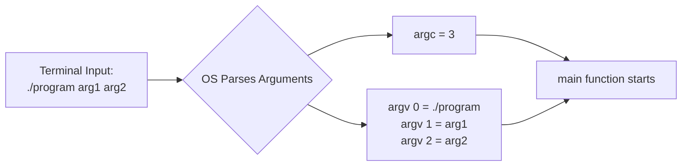

# Day 15: Command Line Arguments

## Theory and Description

Command Line Arguments allow you to pass information into a C program directly from the operating system's terminal/command prompt at the moment the program is executed.

### How it Works
The `main()` function in C can be written to accept two parameters:
```c
int main(int argc, char *argv[])
```
1. **`argc` (Argument Count)**: An integer representing the total number of command-line arguments passed. The executable's name itself is always the first argument, so `argc` is always at least 1.
2. **`argv` (Argument Vector)**: An array of string pointers (character pointers) representing the actual arguments.
   - `argv[0]` holds the name of the program.
   - `argv[1]` holds the first argument, `argv[2]` holds the second, and so on.
   - `argv[argc]` is always a `NULL` pointer.

### Block Diagram: Execution Flow



## Features and Differences

### Using CMD Arguments vs `scanf()`
- **Command Line Arguments**: Passed *before* the program starts running. Excellent for scripts, automation, and non-interactive batch processing.
- **`scanf()`**: Prompts the user *during* program execution. Best for interactive console applications where the user needs guidance.

---

## Assignment Questions and Answers

**Q1. Write a C program that prints all command-line arguments passed to it.**
*Answer*:
```c
#include <stdio.h>

int main(int argc, char *argv[]) {
    printf("Number of arguments: %d\n", argc);
    for(int i = 0; i < argc; i++) {
        printf("Argument %d: %s\n", i, argv[i]);
    }
    return 0;
}
```

**Q2. How do you pass an integer via command line arguments?**
*Answer*: All command line arguments are passed as strings (`char *`). To use an argument as an integer, you must convert the string to an integer using functions like `atoi()` (ASCII to Integer) from the `<stdlib.h>` library. Example: `int val = atoi(argv[1]);`

**Q3. If you run a program as `myprog.exe hello world`, what is the value of `argc`?**
*Answer*: The value of `argc` will be `3`. 
1. `myprog.exe` (argv[0])
2. `hello` (argv[1])
3. `world` (argv[2])
