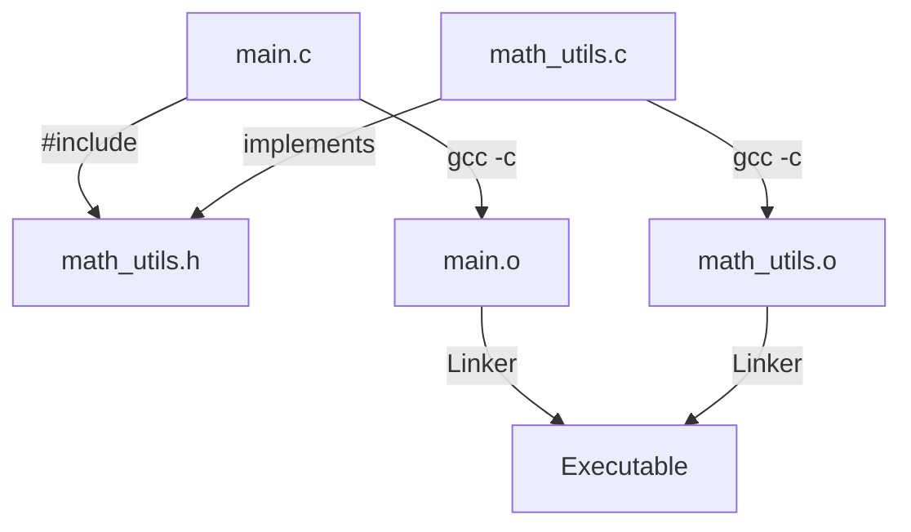

# Day 16: Rest Topics and Demonstrations

## Theory and Description

This folder serves as a repository for miscellaneous C programming concepts, interactive class demonstrations, and utility scripts that do not fall strictly into the sequential curriculum. 

### Common "Rest" Topics in C
1. **Enumerations (`enum`)**: A user-defined data type consisting of integral constants. Makes code more readable (e.g., `enum Days {SUN, MON, TUE};`).
2. **`goto` statement**: A jump statement used to transfer control to a labeled part of the code. Heavily discouraged in modern programming as it creates "spaghetti code."
3. **Type Casting**: Converting a variable from one data type to another (`(int) 3.14`).
4. **Header Files Creation**: How to write and link your own `.h` files to keep projects modular.
5. **Makefiles**: Build automation tools to compile large C projects with multiple source files.

### Block Diagram: Multi-file Compilation



## Features and Differences

### Implicit vs Explicit Type Casting
- **Implicit Casting (Coercion)**: Handled automatically by the compiler. E.g., adding an `int` to a `float` results in the `int` being converted to a `float`.
- **Explicit Casting**: Manually forced by the programmer using a cast operator. E.g., `int result = (int) 4.56;` truncates the decimal.

---

## Assignment Questions and Answers

**Q1. Write a program using `enum` to print the days of the week.**
*Answer*:
```c
#include <stdio.h>

enum Days { SUN, MON, TUE, WED, THU, FRI, SAT };

int main() {
    enum Days today = WED;
    printf("Day number (0-indexed): %d\n", today); // Outputs 3
    return 0;
}
```

**Q2. Why is the `goto` statement generally avoided?**
*Answer*: The `goto` statement breaks the standard top-to-bottom flow of execution, making the code incredibly difficult to read, trace, and debug. Standard control structures like `if`, `while`, and `break` are much safer and clearer alternatives.

**Q3. What is the purpose of a Makefile?**
*Answer*: A Makefile specifies the rules on how to compile and link a program. It tracks file dependencies, so if you change only one `.c` file in a project with 50 files, running `make` will only recompile that single modified file, saving massive amounts of build time.
