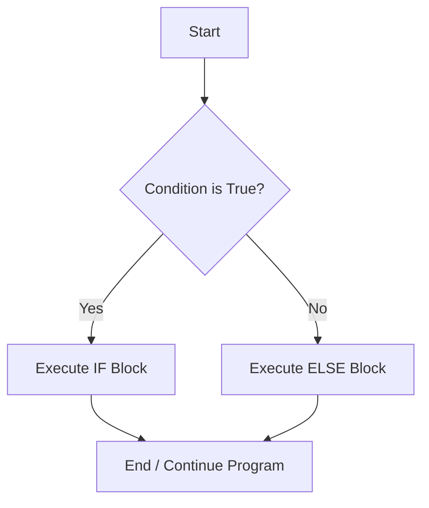

# Day 2: Conditional Statements

## Theory and Description

Conditional statements in C are used to execute a specific block of code based on a condition (which evaluates to true or false). The flow of control in a program can be changed dynamically based on user input or calculated variables.

### Main Conditional Constructs

1. **`if` Statement**: Executes a block of code if the condition is true.
2. **`if-else` Statement**: Executes one block if true, and another if false.
3. **`else-if` Ladder**: Tests multiple conditions sequentially.
4. **`switch` Statement**: An alternative to `else-if` when checking a single variable against multiple constant integer or character values.
5. **Ternary Operator (`?:`)**: A shorthand for simple `if-else` statements.

### Block Diagram: If-Else Execution Flow



## Features and Differences

### `else-if` ladder vs `switch` statement
- **`switch`** is generally faster for a large number of conditions because the compiler can use a jump table, but it only works with equality comparisons (`==`) and constant expressions (integers/chars).
- **`else-if`** can evaluate complex logical expressions (`x > 5 && y < 10`) and float values, offering more flexibility at the cost of slight performance overhead.

---

## Assignment Questions and Answers

**Q1. Write a program to check if a number is even or odd using the ternary operator.**
*Answer*:
```c
#include <stdio.h>

int main() {
    int num = 10;
    (num % 2 == 0) ? printf("Even") : printf("Odd");
    return 0;
}
```

**Q2. Why do we use the `break` statement inside a `switch` case?**
*Answer*: The `break` statement prevents "fall-through". Without `break`, after a matching case is found, the program will execute all subsequent cases sequentially, ignoring their conditions, until it hits the end of the switch or another break.

**Q3. Can we use floating point numbers in switch cases?**
*Answer*: No, the C language standard does not allow floating point values in `switch` statements. The cases must evaluate to an integer constant or a character.
