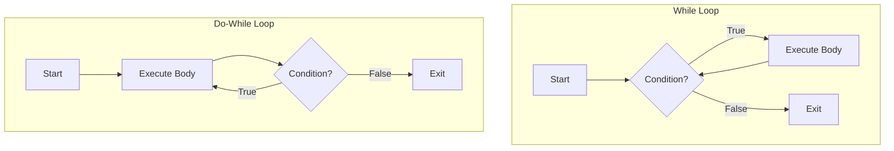

# Day 3: Loops in C

## Theory and Description

Loops allow you to execute a block of code repeatedly as long as a specified condition remains true. They are essential for iterating over arrays, performing repetitive mathematical calculations, and running interactive program shells.

### Types of Loops

1. **`for` loop**: Used when the number of iterations is known beforehand. It consists of initialization, condition, and increment/decrement.
2. **`while` loop**: Used when the number of iterations is not known and depends on a dynamic condition evaluated *before* entering the loop.
3. **`do-while` loop**: Similar to the `while` loop, but the condition is evaluated *after* the loop body executes. This guarantees the loop runs at least once.

### Loop Control Statements
- `break`: Exits the loop immediately.
- `continue`: Skips the current iteration and jumps to the next evaluation.

### Block Diagram: While Loop vs Do-While Loop



## Features and Differences

### `while` vs `do-while`
- A **`while` loop** is an entry-controlled loop. If the condition is false initially, the body never executes.
- A **`do-while` loop** is an exit-controlled loop. The body will always execute **at least once**, even if the condition is false on the first check.

---

## Assignment Questions and Answers

**Q1. Write a program to print the first 10 terms of the Fibonacci sequence using a loop.**
*Answer*:
```c
#include <stdio.h>

int main() {
    int a = 0, b = 1, next, i;
    printf("%d %d ", a, b);
    for(i = 2; i < 10; i++) {
        next = a + b;
        printf("%d ", next);
        a = b;
        b = next;
    }
    return 0;
}
```

**Q2. What will happen if the condition in a `for` loop is omitted (e.g., `for(;;)` )?**
*Answer*: Omitting the condition creates an infinite loop. The loop will run indefinitely until interrupted by a `break` statement or external termination.

**Q3. How does `continue` differ from `break`?**
*Answer*: `break` entirely terminates the innermost loop it resides in. `continue` only terminates the *current iteration*, skipping the remaining code in the loop body and proceeding to the next iteration's evaluation.
