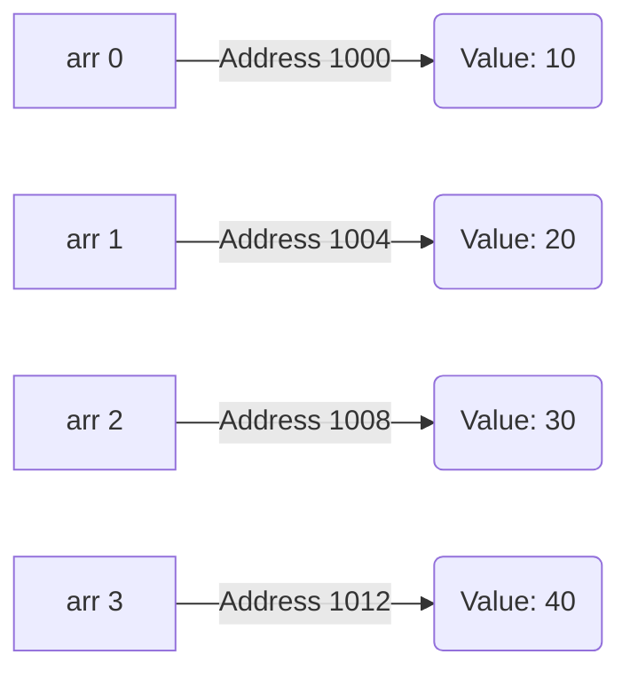

# Day 4: Arrays

## Theory and Description

An array is a collection of elements of the **same data type** stored in **contiguous memory locations**. Arrays provide a way to group related variables under a single name, accessible via an index.

### Concepts
1. **1D Array**: A linear list of elements. Indexed starting from `0`. 
2. **2D Array**: Arrays of arrays, often used to represent matrices or grids. Accessed using two indices `[row][column]`.
3. **Initialization**: Elements can be initialized at declaration: `int arr[3] = {1, 2, 3};`.
4. **Accessing Elements**: Elements are accessed via their index. E.g., `arr[0]` gives the first element.

### Block Diagram: Memory Layout of an Array


*(Assuming `int` takes 4 bytes)*

## Features and Differences

### Array vs Individual Variables
- **Memory**: Arrays guarantee contiguous memory, improving cache performance. Individual variables may be scattered.
- **Scalability**: Defining 100 variables (`int a1, a2...`) is impractical. `int a[100]` is scalable.
- **Iteration**: Arrays can be easily iterated over using a loop.

### Limitations of Arrays in C
1. **Fixed Size**: Once declared, the size of a standard C array cannot be changed dynamically.
2. **No Bounds Checking**: C does not natively check if you are accessing an index out of bounds, which can lead to memory corruption or segmentation faults.

---

## Assignment Questions and Answers

**Q1. Write a C program to find the maximum element in a 1D array.**
*Answer*:
```c
#include <stdio.h>

int main() {
    int arr[] = {45, 12, 78, 34, 99, 23};
    int size = sizeof(arr) / sizeof(arr[0]);
    int max = arr[0];
    
    for(int i = 1; i < size; i++) {
        if(arr[i] > max) {
            max = arr[i];
        }
    }
    printf("Maximum element is %d\n", max);
    return 0;
}
```

**Q2. How is a 2D array stored in memory?**
*Answer*: In C, 2D arrays are stored in **row-major order**. This means the elements of the first row are stored sequentially in memory, followed immediately by the elements of the second row, and so on.

**Q3. What happens if you access `arr[10]` in an array of size 5?**
*Answer*: This results in **Undefined Behavior**. C does not throw an out-of-bounds exception natively. It will attempt to read the memory address corresponding to index 10, which might crash the program (segmentation fault) or return garbage data.
