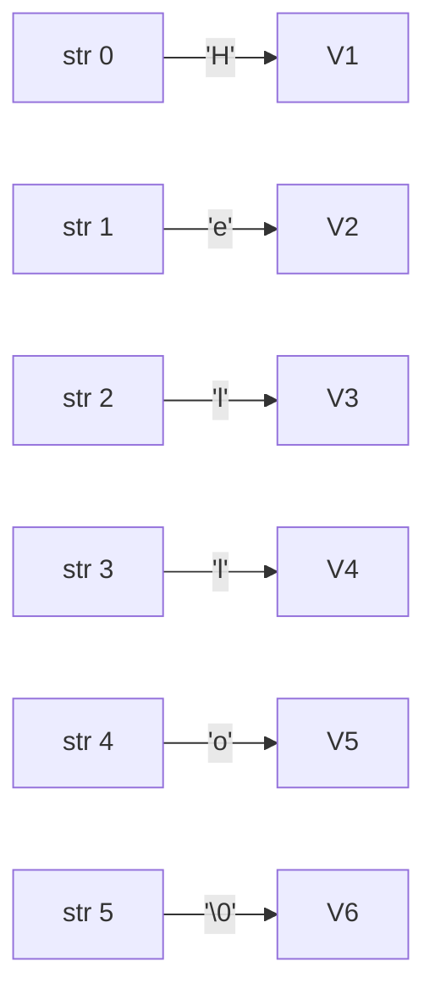

# Day 5: Strings in C

## Theory and Description

In C, a string is not a built-in data type but rather a **1D array of characters** terminated by a special null character `\0`. This null character tells the compiler where the string ends.

### String Operations
C provides a standard library `<string.h>` which contains many useful functions to manipulate strings:
- `strlen(s)`: Returns the length of string `s` (excluding the null terminator).
- `strcpy(dest, src)`: Copies the contents of string `src` into string `dest`.
- `strcat(dest, src)`: Concatenates (appends) string `src` to the end of `dest`.
- `strcmp(s1, s2)`: Compares two strings. Returns 0 if they are exactly identical.
- `strrev(s)`: Reverses a string (Note: non-standard, but available in many compilers like GCC/MinGW).

### Input/Output of Strings
- `scanf("%s", str)`: Reads a single word (stops at whitespace).
- `gets(str)` or `fgets(str, size, stdin)`: Reads a full line of text including spaces. `fgets` is preferred for safety to prevent buffer overflows.

### Block Diagram: String Memory



## Features and Differences

### `scanf("%s")` vs `fgets()`
- **`scanf`** stops reading as soon as it hits a space, tab, or newline. It is useful for single-word inputs.
- **`fgets`** reads the entire line until a newline is encountered or the specified character limit is reached. It protects against buffer overflows.

---

## Assignment Questions and Answers

**Q1. Write a program to find the length of a string without using `strlen()`.**
*Answer*:
```c
#include <stdio.h>

int main() {
    char str[] = "Programming";
    int i = 0;
    while(str[i] != '\0') {
        i++;
    }
    printf("Length of string is: %d", i);
    return 0;
}
```

**Q2. What is the role of `\0` in a string?**
*Answer*: The `\0` (null character) signifies the end of a string in memory. Without it, string functions like `printf` or `strlen` would continue reading into adjacent memory addresses, causing undefined behavior or garbage output.

**Q3. How do you copy a string without using `strcpy()`?**
*Answer*:
```c
#include <stdio.h>

int main() {
    char src[] = "Hello";
    char dest[20];
    int i = 0;
    
    while(src[i] != '\0') {
        dest[i] = src[i];
        i++;
    }
    dest[i] = '\0'; // Manually add the null terminator
    
    printf("Copied string: %s", dest);
    return 0;
}
```
