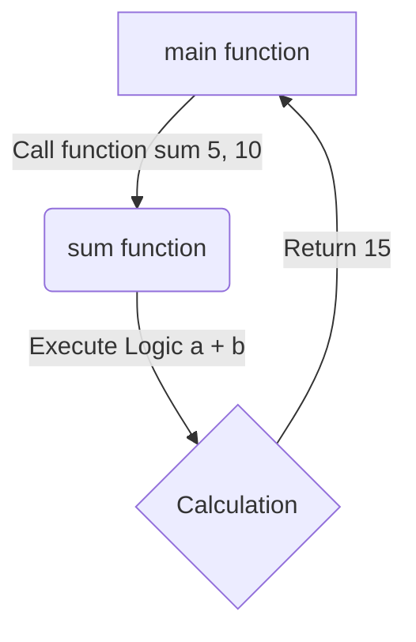

# Day 6: Functions in C

## Theory and Description

A function is a reusable block of code that performs a specific task. Using functions improves code modularity, readability, and allows for code reuse.

### Types of Functions
1. **Predefined/Library Functions**: Built into the C standard library (e.g., `printf()`, `scanf()`, `sqrt()`).
2. **User-Defined Functions**: Created by the programmer to solve specific problems.

### Function Components
- **Function Declaration (Prototype)**: Tells the compiler about the function name, return type, and parameters.
- **Function Definition**: The actual body containing the logic.
- **Function Call**: Executing the function from another part of the program (like `main()`).

### Parameter Passing
- **Call by Value**: A copy of the actual argument is passed to the function. Modifying it inside the function does not affect the original variable.
- **Call by Reference**: The memory address of the variable is passed (using pointers). Modifying the value via the pointer affects the original variable.

### Block Diagram: Function Calling Flow



## Features and Differences

### Call by Value vs Call by Reference
- **Call by Value**: Safest method as original data cannot be modified. Requires more memory if large structs are passed (since they are copied).
- **Call by Reference**: Efficient as no copying is done. Allows a function to modify multiple original variables, but poses a risk if data is modified unintentionally.

---

## Assignment Questions and Answers

**Q1. Write a user-defined function to calculate the square of a number.**
*Answer*:
```c
#include <stdio.h>

int square(int n) {
    return n * n;
}

int main() {
    int num = 5;
    printf("Square of %d is %d", num, square(num));
    return 0;
}
```

**Q2. What is a function prototype and why is it necessary?**
*Answer*: A function prototype is a declaration that specifies a function's name, return type, and parameters before its actual definition. It tells the compiler what to expect, enabling it to check for type mismatches during function calls.

**Q3. Can a C function return multiple values?**
*Answer*: No, a standard C function can only return a single value via the `return` statement. However, you can bypass this limitation by using pointers (Call by Reference) to modify multiple variables, or by returning an array or a `struct`.
