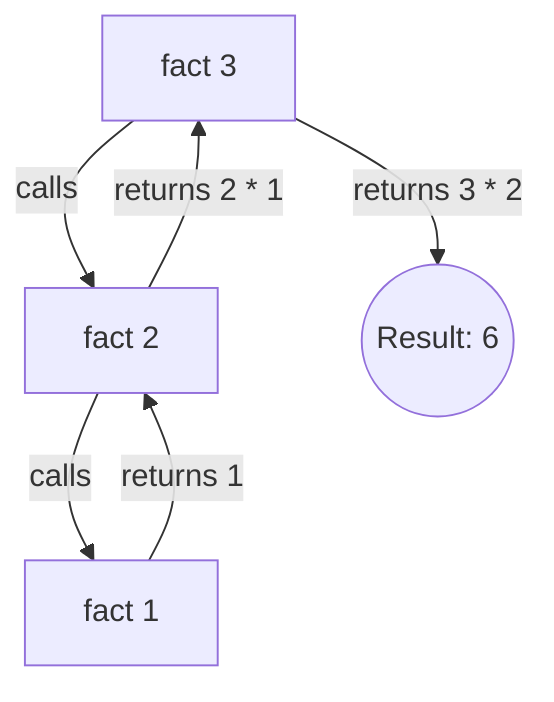

# Day 7: Recursion

## Theory and Description

Recursion is a programming technique where a function calls itself directly or indirectly to solve a smaller instance of the same problem. 

### Key Components of a Recursive Function
1. **Base Case**: The condition under which the recursion stops. Without a base case, the function will call itself infinitely, leading to a stack overflow.
2. **Recursive Case**: The part of the function where it calls itself with a modified parameter, moving closer to the base case.

### Call Stack
When a recursive function is called, each call is pushed onto the **call stack**. The stack stores the local variables and execution state of each function call. When the base case is reached, the stack starts "unwinding", returning values back to the previous calls.

### Block Diagram: Recursive Call Stack (Factorial of 3)



## Features and Differences

### Recursion vs Iteration (Loops)
- **Code Clarity**: Recursive code is often shorter and more mathematically intuitive (e.g., Tree traversals, Fibonacci).
- **Memory Usage**: Recursion consumes more memory because each function call adds a new frame to the call stack. Iteration only uses a single stack frame.
- **Performance**: Recursion can be slower due to the overhead of repeated function calls, whereas loops are generally faster and more memory-efficient.

---

## Assignment Questions and Answers

**Q1. Write a recursive function to find the factorial of a number.**
*Answer*:
```c
#include <stdio.h>

int factorial(int n) {
    if (n == 0 || n == 1) // Base case
        return 1;
    else
        return n * factorial(n - 1); // Recursive case
}

int main() {
    int num = 5;
    printf("Factorial of %d is %d", num, factorial(num));
    return 0;
}
```

**Q2. What is a "Stack Overflow" error in recursion?**
*Answer*: A Stack Overflow occurs when a recursive function calls itself too many times without reaching a base case. Since each call consumes a portion of the computer's memory (the call stack), infinite recursion exhausts this memory, crashing the program.

**Q3. Write a recursive program to print the Fibonacci sequence.**
*Answer*:
```c
#include <stdio.h>

int fibonacci(int n) {
    if (n == 0) return 0;
    if (n == 1) return 1;
    return fibonacci(n - 1) + fibonacci(n - 2);
}

int main() {
    int n = 5;
    for(int i = 0; i < n; i++) {
        printf("%d ", fibonacci(i));
    }
    return 0;
}
```
