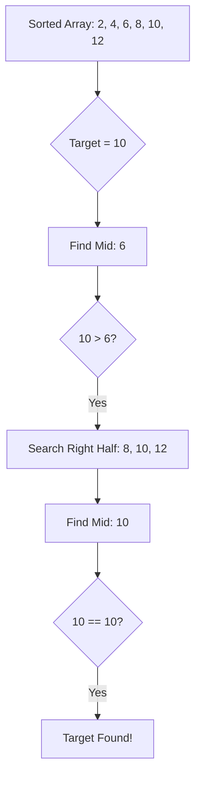

# Day 8: Searching and Sorting Algorithms

## Theory and Description

Searching and sorting are fundamental operations in Computer Science, often implemented on arrays. 

### Searching Algorithms
1. **Linear Search**: Iterates through each element in the array one by one until the target is found.
   - Time Complexity: O(n)
2. **Binary Search**: Works only on **sorted arrays**. It repeatedly divides the search interval in half. If the target is less than the middle element, it searches the lower half, otherwise the upper half.
   - Time Complexity: O(log n)

### Sorting Algorithms
1. **Bubble Sort**: Repeatedly steps through the list, compares adjacent elements, and swaps them if they are in the wrong order.
2. **Merge Sort**: A divide-and-conquer algorithm that divides the array into halves, recursively sorts them, and then merges the sorted halves.

### Block Diagram: Binary Search Concept



## Features and Differences

### Linear Search vs Binary Search
- **Linear Search** can be used on unsorted arrays, but it is slow for large datasets.
- **Binary Search** is exponentially faster for large datasets, but strictly requires the data to be sorted beforehand.

---

## Assignment Questions and Answers

**Q1. Write a C program to implement Linear Search.**
*Answer*:
```c
#include <stdio.h>

int linearSearch(int arr[], int n, int target) {
    for(int i = 0; i < n; i++) {
        if(arr[i] == target) return i;
    }
    return -1;
}

int main() {
    int arr[] = {10, 50, 30, 70, 80};
    int target = 30;
    int index = linearSearch(arr, 5, target);
    if(index != -1) printf("Found at index %d", index);
    else printf("Not found");
    return 0;
}
```

**Q2. Why is Binary Search faster than Linear Search?**
*Answer*: In Linear Search, the number of checks grows linearly with the size of the array (O(n)). In Binary Search, the search space is halved in every step, meaning even for an array of 1 million elements, it takes at most ~20 comparisons to find the target (O(log n)).

**Q3. Write the Merge Sort recursive concept.**
*Answer*: Merge sort involves dividing the array recursively until sub-arrays of size 1 are reached, which are inherently sorted. Then, the `merge` function is called to combine these smaller sorted arrays back together in correct order until the full array is reconstructed.
