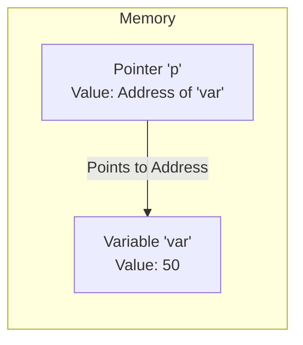

# Day 9: Pointers

## Theory and Description

A pointer is a variable that stores the **memory address** of another variable. Pointers are a powerful feature of C that allow direct memory manipulation, dynamic memory allocation, and efficient array handling.

### Pointer Basics
1. **Declaration**: `int *p;` declares a pointer `p` that can hold the address of an `int`.
2. **Address-of Operator (`&`)**: Returns the memory address of a variable. `p = &var;`
3. **Dereference Operator (`*`)**: Accesses the value stored at the memory address the pointer is holding. `int val = *p;`

### Types of Pointers
- **Null Pointer**: A pointer that points to nothing (`NULL`). `int *p = NULL;`
- **Void Pointer**: A generic pointer (`void *`) that can point to any data type. It must be typecast before dereferencing.
- **Pointer to Pointer**: A pointer that stores the address of another pointer (`int **p;`).

### Block Diagram: Pointer Concept



## Features and Differences

### Pass by Value vs Pass by Reference
- **Value**: Function works on a copy. Slower for large data structures.
- **Reference (Using Pointers)**: Function works on the original variable's memory address. Memory efficient and allows the function to modify the original variable.

---

## Assignment Questions and Answers

**Q1. Write a C program to swap two numbers using pointers.**
*Answer*:
```c
#include <stdio.h>

void swap(int *a, int *b) {
    int temp = *a;
    *a = *b;
    *b = temp;
}

int main() {
    int x = 10, y = 20;
    swap(&x, &y);
    printf("x = %d, y = %d", x, y);
    return 0;
}
```

**Q2. What is a wild pointer?**
*Answer*: A wild pointer is an uninitialized pointer that points to a random memory location. Dereferencing it can cause a segmentation fault. Always initialize pointers to `NULL` or a valid memory address.

**Q3. How does pointer arithmetic work with arrays?**
*Answer*: Adding 1 to a pointer (`p++`) does not add 1 byte to the address; it adds the `sizeof(data_type)` to the address. For an `int` pointer (4 bytes), `p+1` points to the next integer in memory (current address + 4).
